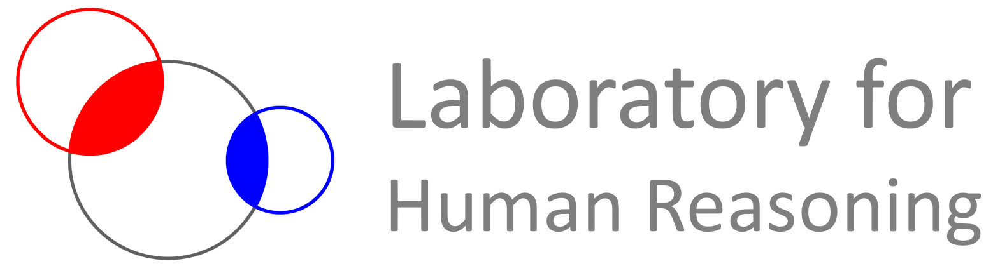

  

## About Us
Welcome to the GitHub home of the Laboratory for Human Reasoning. We are a 🔬 cognitive neuroscience lab dedicated to understanding the neural basis of human 🤔 reasoning and 🔗 association.

We use 🧩 cognitive tasks coupled with 🧠 neural and 👁️ behavioral recordings to investigate phenomena like 🔎 logical inference and 🎯 strategic planning. If you've ever wondered how the mind thinks its way through a game of ♟️ chess, so do we!

## Contact Us
We are actively seeking 🤝 collaborators and 🧑‍🤝‍🧑 new team members. If you are interested in working together, please get in touch!

✉️ **Email:** [humanreasoning.lab@gmail.com](mailto:humanreasoning.lab@gmail.com)

🌐 **Website:** <https://human-reasoning.github.io>
